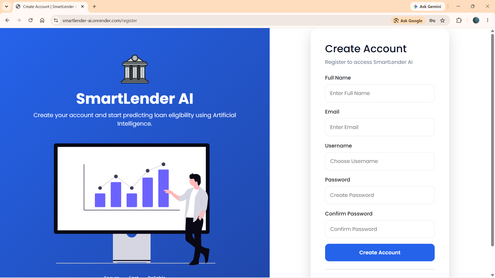
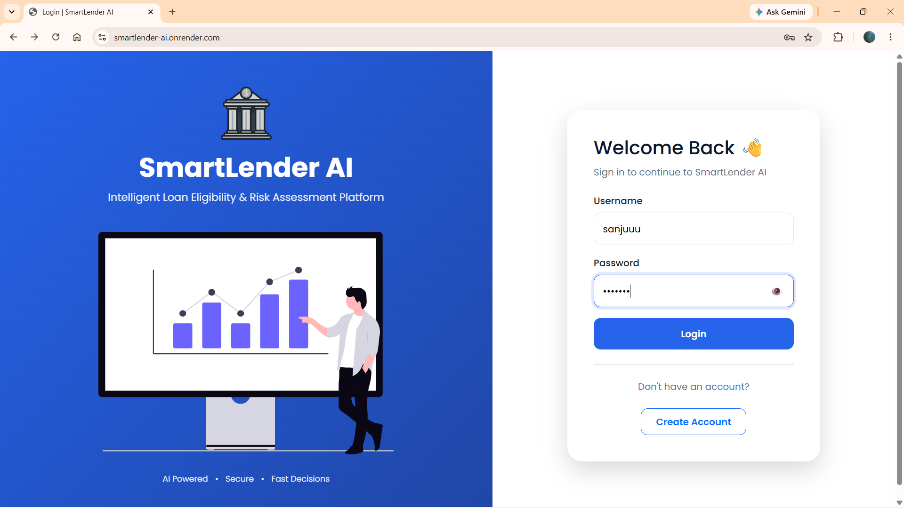
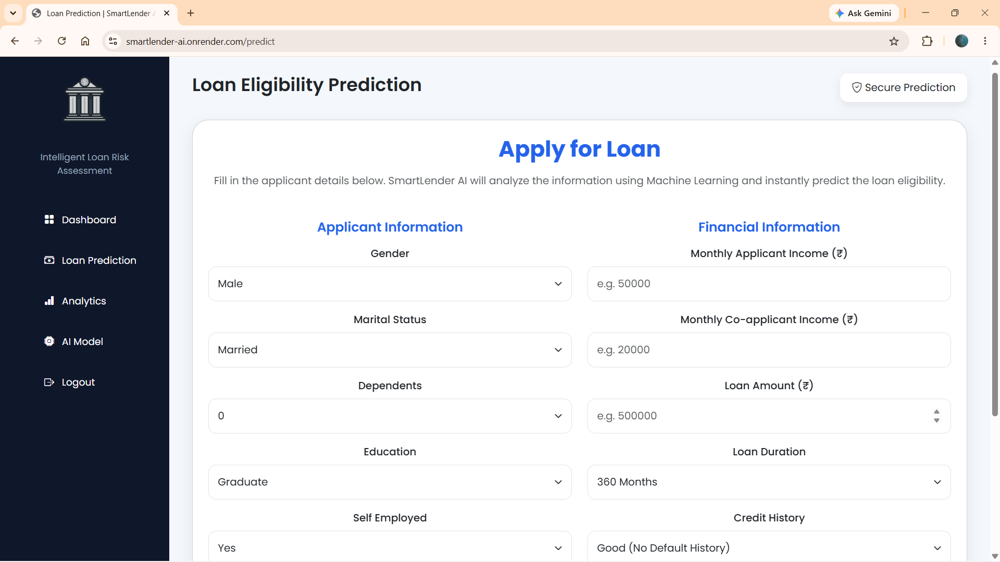
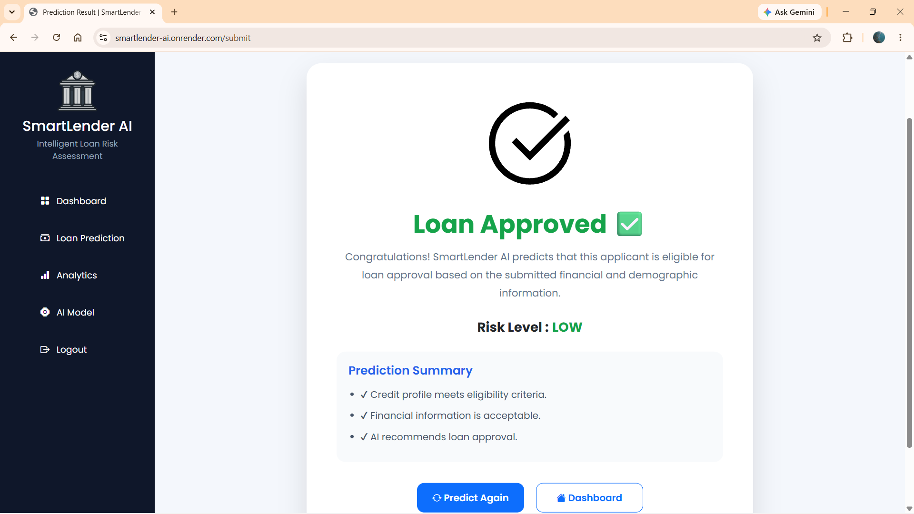
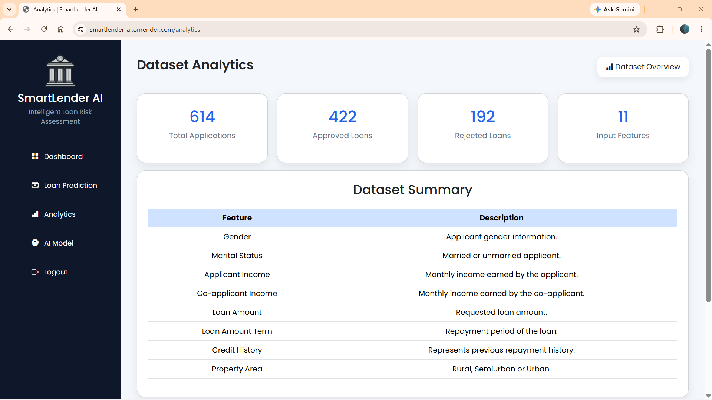
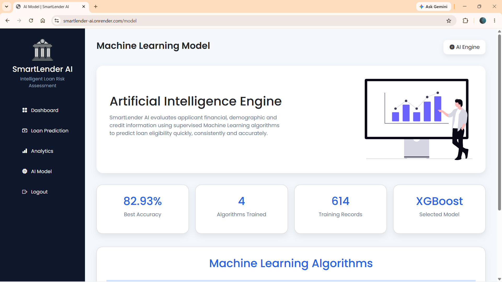

# 🚀 SmartLender AI - Loan Eligibility Prediction System

An AI-powered Loan Eligibility Prediction System built using **Flask**, **Python**, and **Machine Learning** to predict whether an applicant is eligible for a loan. The application provides secure user authentication, real-time predictions, analytics, and an intuitive web interface to assist financial institutions in making faster and more consistent lending decisions.

---

## 🌐 Live Demo

**Application:** https://smartlender-ai.onrender.com

---

## 📖 Project Overview

SmartLender AI automates the loan eligibility assessment process by leveraging Machine Learning techniques. Users can securely register, log in, enter applicant details, and receive an instant prediction based on historical loan data.

The project integrates data preprocessing, feature engineering, machine learning, database management, and web development into a single intelligent application.

---

# ✨ Features

- 🔐 Secure User Registration & Login
- 🤖 AI-Based Loan Eligibility Prediction
- 📊 Analytics Dashboard
- 🧠 AI Model Information
- 📈 Feature Engineering & Data Preprocessing
- 💾 SQLite Database Integration
- 📱 Responsive User Interface
- ☁️ Cloud Deployment using Render

---

# 🛠️ Technologies Used

### Backend
- Python
- Flask

### Frontend
- HTML5
- CSS3
- Bootstrap
- JavaScript

### Machine Learning

- Scikit-learn
- XGBoost (Final Deployed Model)
- Random Forest
- Decision Tree
- K-Nearest Neighbors (KNN)
- Pandas
- NumPy
- Joblib
- SMOTE (Imbalanced-learn)

### Database
- SQLite

### Deployment
- GitHub
- Render

---

# 📂 Dataset

**Loan Prediction Dataset**

- Total Records: **614**
- Features: **17**
- Target Variable: **Loan Status (Approved / Rejected)**

### Feature Engineering

The following additional features were created to improve model performance:

- Total Income
- Loan-Income Ratio
- Monthly Loan Burden

---

# 🤖 Machine Learning Models

The following Machine Learning algorithms were trained and evaluated:

| Algorithm | Accuracy |
|-----------|----------|
| Decision Tree | 72.36% |
| K-Nearest Neighbors (KNN) | 73.17% |
| Random Forest | 81.45% |
| **XGBoost** | **82.93% ✅** |

### Final Selected Model

**XGBoost Classifier**

**Accuracy:** **82.93%**

The XGBoost model achieved the highest prediction accuracy among all evaluated algorithms and was selected as the final deployed model for the SmartLender AI application due to its superior performance and robustness.

# 📊 Project Workflow

```
User Login/Register
        │
        ▼
Enter Applicant Details
        │
        ▼
Data Validation
        │
        ▼
Data Preprocessing
        │
        ▼
Feature Engineering
        │
        ▼
Machine Learning Prediction
        │
        ▼
Prediction Result
        │
        ▼
Analytics & AI Model Information
```

---

# 📁 Project Structure

```
SmartLender-AI/
│
├── dataset/
├── Documentation/
├── model/
│   ├── loan_model.pkl
│   ├── scaler.pkl
│   └── preprocessed_data.pkl
│
├── static/
│
├── templates/
│
├── app.py
├── database.py
├── preprocessing.py
├── train_model.py
├── users.db
├── Procfile
├── requirements.txt
└── README.md
```

---

# ⚙️ Installation

### Clone the Repository

```bash
git clone https://github.com/ratnapriyanka-999/SmartLender-AI.git
```

### Navigate to the Project Folder
# 🚀 SmartLender AI

### AI-Powered Loan Eligibility Prediction System

> An intelligent web application that predicts loan eligibility using Machine Learning and provides secure user authentication, real-time predictions, analytics, and AI model insights.

<p align="center">


</p>

---

# 🌐 Live Demo

🔗 **Application**

https://smartlender-ai.onrender.com

💻 **GitHub Repository**

https://github.com/ratnapriyanka-999/SmartLender-AI

---

# 📖 Project Overview

SmartLender AI is an AI-powered Loan Eligibility Prediction System developed using **Flask**, **Python**, and **Machine Learning**. The application automates the loan eligibility assessment process by analyzing applicant financial, demographic, and credit-related information.

Users can securely register, log in, submit loan application details, and instantly receive loan eligibility predictions through a trained Machine Learning model. The system combines data preprocessing, feature engineering, predictive analytics, and an intuitive web interface into a single intelligent platform.

---

# 🎯 Project Objectives

- Automate loan eligibility prediction using Machine Learning.
- Reduce manual effort in the loan approval process.
- Improve decision-making using AI-based predictions.
- Deliver accurate and real-time loan eligibility assessment.
- Provide a secure and user-friendly web application.

---

# ✨ Features

- 🔐 Secure User Registration & Login
- 🤖 AI-Based Loan Eligibility Prediction
- 📊 Analytics Dashboard
- 🧠 AI Model Information
- 📈 Feature Engineering & Data Preprocessing
- 💾 SQLite Database Integration
- 📱 Fully Responsive User Interface
- ☁️ Cloud Deployment using Render

---

# 🛠️ Technology Stack

| Category | Technologies |
|-----------|--------------|
| Backend | Python, Flask |
| Frontend | HTML5, CSS3, Bootstrap, JavaScript |
| Machine Learning | XGBoost, Random Forest, Decision Tree, K-Nearest Neighbors (KNN), Scikit-learn |
| Data Processing | Pandas, NumPy, Joblib, SMOTE |
| Database | SQLite |
| Deployment | Render |
| Version Control | Git & GitHub |

---

# 📂 Dataset

**Loan Prediction Dataset**

- Total Records: **614**
- Features: **17**
- Target Variable: **Loan Status (Approved / Rejected)**

The dataset contains applicant demographic, financial, and credit-related information used to train the Machine Learning models.

### Feature Engineering

Additional features created during preprocessing include:

- Total Income
- Loan-Income Ratio
- Monthly Loan Burden

These engineered features improve the predictive performance of the Machine Learning model.

---

# 🤖 Machine Learning Models

The following Machine Learning algorithms were trained and evaluated:

| Algorithm | Accuracy |
|-----------|----------|
| Decision Tree | 72.36% |
| K-Nearest Neighbors (KNN) | 73.17% |
| Random Forest | 81.45% |
| **XGBoost** | **82.93% ✅** |

## Final Selected Model

**XGBoost Classifier**

**Final Accuracy:** **82.93%**

The XGBoost model achieved the highest prediction accuracy among all evaluated Machine Learning algorithms and was selected as the final deployed model for SmartLender AI.

---

# 📊 Project Workflow

```text
        User Login / Register
                 │
                 ▼
      Enter Applicant Details
                 │
                 ▼
          Data Validation
                 │
                 ▼
        Data Preprocessing
                 │
                 ▼
       Feature Engineering
                 │
                 ▼
     XGBoost Machine Learning Model
                 │
                 ▼
      Loan Eligibility Prediction
                 │
                 ▼
          Display Prediction
                 │
                 ▼
   Analytics & AI Model Information
```

---

# 🏗️ Project Architecture

```text
           User
             │
             ▼
     Login / Register
             │
             ▼
       Flask Backend
             │
             ▼
     Data Preprocessing
             │
             ▼
    XGBoost ML Model
             │
             ▼
 Loan Eligibility Prediction
             │
             ▼
      Prediction Result
```

---

# 📁 Project Structure

```text
SmartLender-AI/
│
├── assets/
│   └── screenshots/
│
├── dataset/
├── Documentation/
├── model/
├── static/
├── templates/
├── __pycache__/
│
├── app.py
├── analysis.py
├── database.py
├── preprocessing.py
├── train_model.py
├── users.db
├── requirements.txt
├── Procfile
├── .gitignore
└── README.md
```

---

# ⚙️ Installation

### Clone the Repository

```bash
git clone https://github.com/ratnapriyanka-999/SmartLender-AI.git
```

### Navigate to the Project Directory

```bash
cd SmartLender-AI
cd SmartLender-AI
```

### Install Dependencies
### Install Required Packages

```bash
pip install -r requirements.txt
```

### Run the Application
### Run the Application

```bash
python app.py
```

### Open in Browser
### Open in Browser

```
http://127.0.0.1:5000
```

---

# 📷 Application Screenshots

Add screenshots of the following pages:

- Login Page
- Registration Page
- Dashboard
- Loan Prediction
- Prediction Result
- Analytics Dashboard
- AI Model Information

---

# 🚀 Future Enhancements

- Admin Dashboard
- Loan Application History
- Email Notifications
- Explainable AI (XAI)
- PDF Report Generation
- Multi-Bank Integration
- Cloud Database Support

---

# 👩‍💻 Developer

**Ratna Priyanka Maddula**

Bachelor of Engineering Student

---

# 🙏 Acknowledgements

- Flask
- Scikit-learn
- Pandas
- NumPy
- Bootstrap
- Render
- Kaggle Loan Prediction Dataset

---

# 📜 License

This project is developed for **academic and educational purposes**.

---

# 📷 Application Screenshots

## 🔐 Authentication

| Registration | Login |
|---------------|--------|
|  |  |

---

## 🏠 Main Application

| Dashboard | Loan Prediction |
|------------|-----------------|
|  |  |

---

## 🤖 Prediction & Analytics

| Prediction Result | Analytics Dashboard |
|-------------------|---------------------|
|  |  |

---

## 🧠 AI Model Information

<p align="center">

</p>

---

# 🚀 Future Enhancements

- Admin Dashboard
- Loan Application History
- Email Notifications
- Explainable AI (XAI)
- PDF Report Generation
- Multi-Bank Integration
- Cloud Database Support
- Mobile Application
- REST API Integration

---

# 👩‍💻 Developer

**Ratna Priyanka Maddula**

Bachelor of Engineering Student

**Machine Learning & Full Stack Development Enthusiast**

GitHub:

https://github.com/ratnapriyanka-999

---

# 🙏 Acknowledgements

Special thanks to the following technologies and communities that supported this project:

- Flask
- Scikit-learn
- XGBoost
- Pandas
- NumPy
- Bootstrap
- Render
- Kaggle Loan Prediction Dataset

---

# 📜 License

This project is developed for **academic and educational purposes**. It demonstrates the practical implementation of Machine Learning, Flask web development, and AI-powered loan eligibility prediction.

---

<p align="center">

⭐ If you found this project useful, consider giving it a star on GitHub!

</p>